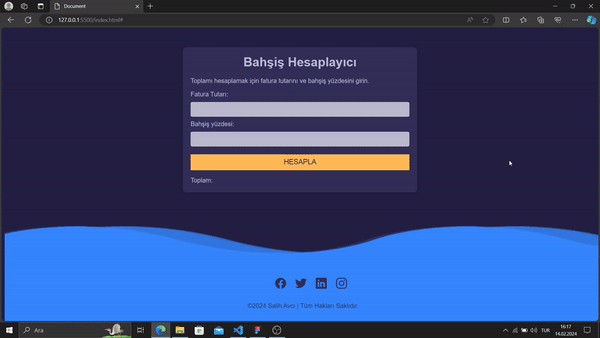

# Bahşiş Hesaplayıcı Projesi

Bu proje, kullanıcıların bir fatura tutarı ve bahşiş yüzdesi girerek toplam miktarı hesaplayabilecekleri basit bir web uygulamasını içerir.

## Özellikler

- Kullanıcılar fatura tutarını ve bahşiş yüzdesini girebilir.
- "Hesapla" düğmesine tıkladıklarında, toplam tutar otomatik olarak hesaplanır ve ekranda gösterilir.
- Sayfa alt kısmında, geliştiricinin sosyal medya profillerine yönlendiren sosyal medya ikonları ve iletişim bilgileri yer alır.

## Teknolojiler

Bu proje aşağıdaki teknolojileri kullanır:

- HTML5
- CSS3
- JavaScript (ES6+)
- [Ionicons](https://ionicons.com/) - Sosyal medya ikonları için kullanılan kütüphane

## Nasıl Kullanılır?

1. Fatura tutarını "Fatura Tutarı" alanına girin.
2. Bahşiş yüzdesini "Bahşiş yüzdesi" alanına girin.
3. "Hesapla" düğmesine tıklayın.
4. Toplam tutarı "Toplam" alanında görüntüleyin.

## Geliştirici

- [Salih Avcı](https://github.com/slhvci)

## Lisans

Bu proje [MIT Lisansı](LICENSE) ile lisanslanmıştır.

## Ekran Görüntüsü

